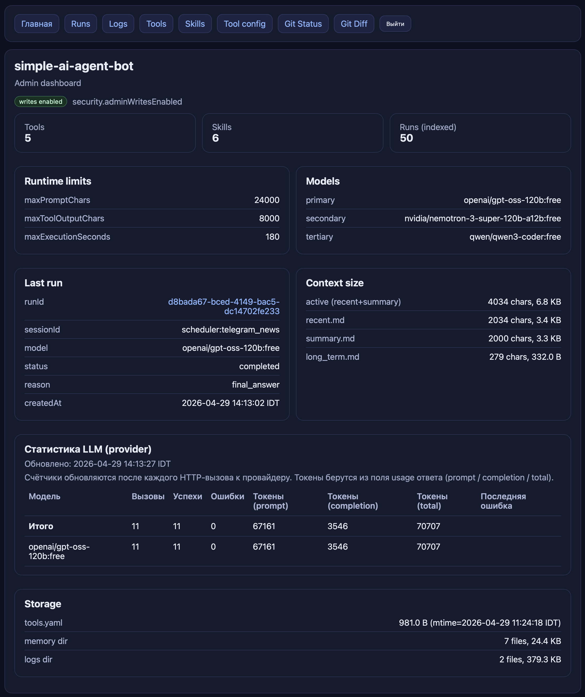

# simple_AI_agent_bot


Монолитный MVP AI-агент с управляемым agentic loop, Telegram-ботом, fallback по OpenRouter и веб-админкой для наблюдаемости.



## Быстрый старт (локально)

1) Создать venv и поставить зависимости:

```bash
python3.12 -m venv .venv
source .venv/bin/activate
pip install -r requirements.txt
```

2) Подготовить конфиг и `.env`:

```bash
cp app/config/config.example.yaml app/config/config.yaml
cp .env.example .env
```

3) Заполнить `.env`:

```env
TELEGRAM_BOT_TOKEN=...
OPENROUTER_API_KEY=...
SESSION_COOKIE_SECRET=your-long-secret-at-least-32-chars
ADMIN_RAW_TOKENS=admin_token_123456,admin_token_654321
EMAIL_APP_PASSWORD=your_gmail_app_password
```

4) Запустить приложение:

```bash
uvicorn app.main:app --host 0.0.0.0 --port 8000
```

Переменные из окружения терминала имеют приоритет над значениями из `.env`.

## Что это умеет (коротко)

- **Telegram**: личные чаты, allowlist по user id, команды `/start`, `/health`, `/reset`, `/context`.
- **Agent runtime**: strict JSON-выход, agentic loop, лимиты по шагам/времени/tool calls, repair-pass для JSON.
- **OpenRouter**: primary/secondary/tertiary модели, retry и fallback с логированием.
- **Инструменты (tools)**: `digest_telegram_news`, `save_digest_preference`, `save_email_preference`, `web_search`, `read_memory_file`, `read_email`, `schedule_reminder`, `list_reminders`, `delete_reminder`.
- **Skills & memory**: Markdown skills, rule-based selection, память recent/summary/long-term.
- **Observability**: runs в `data/runs/<runId>.json` + `index.jsonl`, JSONL-логи, web UI (`/`, `/runs`, `/logs`, `/tools`, `/skills`, `/git/*`).
- **Scheduler (variant B)**: встроенные запуски внутренних run-ов по расписанию.

## Веб-админка

- **Логин**: `GET /login` + `POST /login` (admin token из `ADMIN_RAW_TOKENS`), cookie TTL 12h.
- **Основные страницы**: `/`, `/runs`, `/logs`, `/tools`, `/skills`, `/config/tools`, `/git/status`, `/git/diff`.
- **Favicon/branding**:
  - используется `GET /favicon.ico` (файл `favicon.ico` в корне репозитория);
  - для favicon выставлены anti-cache заголовки (`Cache-Control: no-store`, `Pragma: no-cache`, `Expires: 0`);
  - в HTML используется версионирование URL (`/favicon.ico?v=1`) для стабильного cache-bust после замены иконки.
- **JSON API** (`/internal/*`): без сессии возвращают **401** (без редиректа на `/login`).
- **Read-only / writes enabled**:
  - по умолчанию админка в режиме read-only;
  - чтобы включить редактирование skills и `tools.yaml`, выставь `security.adminWritesEnabled: true` в `app/config/config.yaml` и перезапусти сервис.
  - важно: для редактирования skills в production `skills.skillsDirPath` должен указывать на writable директорию (рекомендуется `./data/skills`, см. `app/config/config.example.yaml`); иначе будет 500 из-за `PermissionError`.

## Конфиги и секреты

- **Основной конфиг**: `app/config/config.yaml` (без секретов).
- **Секреты только через env**: `TELEGRAM_BOT_TOKEN`, `OPENROUTER_API_KEY`, `SESSION_COOKIE_SECRET`, `ADMIN_RAW_TOKENS`, `EMAIL_APP_PASSWORD`.

Требования к web-auth:
- `SESSION_COOKIE_SECRET` — минимум 32 символа
- `ADMIN_RAW_TOKENS` — CSV, 1..`security.maxAdminTokens` токенов
- каждый admin token — минимум 16 символов, только `A-Z a-z 0-9 . _ -`, без дублей

## Time zone

- **Отображение времени в web-админке** настраивается через `app.displayTimeZone` в `app/config/config.yaml` (IANA zone, например `Europe/Moscow` или `Asia/Jerusalem`).
- Если `app.displayTimeZone` пустой или некорректный, отображение автоматически fallback в `UTC`.
- **Scheduler** (`schedule.allowedHourStart / allowedHourEnd` в `app/config/schedules.yaml`) работает в **локальном времени сервера**.
- Для стабильности логики в tools/runtime часть вычислений ведётся в `UTC` (например, `sinceUnixTs: 0` для news digest трактуется как начало текущих суток UTC).

## Инструменты и их настройки (`tools.yaml`)

Часть настроек инструментов вынесена в `app/config/tools.yaml`.

Рекомендуемый подход:
- держать в git файл-пример `app/config/tools.example.yaml`
- локально копировать его в `app/config/tools.yaml` (он добавлен в `.gitignore`)

Что там настраивается:
- **`digest_telegram_news`**: `telegramNewsDigest.digestChannelUsernames`, `telegramNewsDigest.portfolioTickers`, `telegramNewsDigest.digestSemanticKeywords`; в вызове доступны args `channels`, `topics`, `keywords`, `sinceHours`, `sinceUnixTs`, `maxItems`
- **`save_digest_preference`**: пишет строку предпочтений в долгосрочную память (`digest_pref_json` в `long_term.md`); вызывать после уточнения у пользователя
- **`save_email_preference`**: пишет строку email-предпочтений (`email_pref_json` в `long_term.md`) с полями `preferredSenders` (email/домены) и `preferredKeywords`; используется skill-ом `email_preference_feedback`
- **`read_email`**: `emailReader.*` (host/port/ssl/email и т.д.), пароль — только в env: `EMAIL_APP_PASSWORD`

Путь к `tools.yaml` задаётся в `app/config/config.yaml`:

```yaml
tools:
  toolsConfigPath: "./app/config/tools.yaml"
```

Изменения в `tools.yaml` применяются **без перезапуска**.

## Email-дайджест и категории

Email-дайджест строится агентом по skill-инструкциям `compose_digest` + `read_and_analyze_email` и всегда содержит ровно 3 категории (даже если какая-то пустая):

1. `Требуют ответа/действия или предпочтительные отправители` — письма, требующие действий (вопросы/просьбы/верификации/доставки/банковские/корпоративные действия), а также письма от **предпочтительных отправителей** из long-term памяти.
2. `Важные` — содержательные письма без явного действия (аналитика, профильные дайджесты, работа, личное); промо/реклама сюда не попадает.
3. `Остальное/мусор` — промо/реклама/рассылки/маркетинг/низкоценностные авто-уведомления соцсетей.

### Предпочтительные отправители (preferred senders)

- хранятся в `data/memory/long_term.md` строкой вида `- email_pref_json: {...}` (`kind=email_user_preference`);
- ключевые поля: `preferredSenders` (список email-адресов или доменов в нижнем регистре, например `research@aton.ru`, `alfabank.ru`), `preferredKeywords`, `userNote`;
- в run-prompt подставляются как блок **`## Email preference hints`** (только в long-term-only режиме памяти, см. ниже);
- сохраняются через tool `save_email_preference` (вызывается skill-ом `email_preference_feedback` после уточнения у пользователя).

Пример пользовательского сценария:
- "запомни, что письма от research@aton.ru важные и должны попадать в первую категорию" → `email_preference_feedback` → `save_email_preference`.

### Изоляция памяти для email-дайджеста

Когда выбраны skills `compose_digest + read_and_analyze_email` (например, scheduler-job `email_digest_hourly`), `RunAgentUseCase` подаёт в prompt **только** блок Long-Term Memory (без Session Summary и Recent Messages), чтобы каждый периодический запуск дайджеста заново читал почту, не отвечая "уже было выше".

## Scheduler (variant B): автоматические запуски по расписанию

Встроенный планировщик запускает **внутренние run-ы агента** по расписанию (каждый job — своё расписание).

Как включить:

1) В `app/config/config.yaml`:

```yaml
scheduler:
  enabled: true
  schedulesConfigPath: "./app/config/schedules.yaml"
  tickSeconds: 30
```

2) Создать файл расписаний:

```bash
cp app/config/schedules.example.yaml app/config/schedules.yaml
```

Формат `app/config/schedules.yaml`:
- `jobs[]`:
  - `jobId` — уникальный ID job-а
  - `enabled` — включён/выключен
  - `schedule.intervalSeconds` — интервал в секундах (минимум 5)
  - `schedule.allowedHourStart / allowedHourEnd` — окно часов (например 8..23), локальное время сервера
  - `actionInternalRun.sessionId` — sessionId для этих run-ов (удобно выделять `scheduler:*`)
  - `actionInternalRun.message` — короткий intent-текст, который будет отправлен агенту как пользовательское сообщение
- `reminders[]`:
  - `reminderId`, `enabled`, `message`
  - `schedule.kind` (`daily|weekly`), `schedule.weekdays` (для `weekly`), `schedule.timeLocal`, `schedule.timeZone`, `schedule.remainingRuns`

Рекомендация:
- держи `actionInternalRun.message` максимально коротким (без длинных шаблонов формата ответа);
- правила формата/структуры ответа должны жить в skills (например `compose_digest`, `read_and_analyze_email`, `telegram_news_digest`).
- для напоминаний используй skill `schedule_reminder`: модель формирует JSON строго по schema tool-а, без NLP-парсинга текста пользователя внутри tool.

Важно: `scheduler.tickSeconds` задаётся только в `app/config/config.yaml`.

State jobs/reminders сохраняется в: `data/scheduler/jobs_state.json` (`jobsState` + `remindersState`).

## Запуск тестов

Запускай из venv из **корня репозитория** (чтобы пакет `app` находился на `PYTHONPATH`):

```bash
PYTHONPATH=. pytest
```

## Production deploy (VPS + GitHub Actions + Docker Compose)

Ниже — рекомендуемый production-процесс: GitHub Actions собирает Docker image и публикует в GHCR, а VPS делает `docker compose pull && up -d`.

### Что уже настроено для деплоя (чеклист операций)

1) В репозитории добавлен ручной workflow GitHub Actions:
- файл: `.github/workflows/deploy_vps_manual.yml`
- триггер: `workflow_dispatch` (ручной запуск)
- входной параметр: `ref` (ветка / tag / commit SHA)

2) В workflow настроены права и пайплайн сборки:
- `permissions`: `contents: read`, `packages: write`
- checkout выбранного `ref`
- установка Python 3.12 и зависимостей
- прогон unit-тестов: `PYTHONPATH=. pytest -q`
- сборка Docker image и push в GHCR
- теги image: `ghcr.io/<owner>/<repo>:sha-<shortSha>` и `manual-latest`

3) В workflow настроен отдельный deploy job на VPS:
- environment: `production`
- установка SSH-ключа из GitHub Secret
- добавление VPS в `known_hosts`
- загрузка на VPS файлов деплоя:
  - `docker-compose.prod.yml`
  - `scripts/deploy_prod.sh`
- выставление executable-права на `scripts/deploy_prod.sh`
- запуск деплоя по SSH с передачей `APP_IMAGE`, `GHCR_USERNAME`, `GHCR_TOKEN`

4) На VPS подготовлена структура для деплоя:
- директория приложения (по умолчанию: `/opt/simple_ai_agent_bot`)
- подкаталоги: `scripts`, `config`, `data`
- персистентные данные вынесены в `data/` (runs/logs/memory/scheduler)

5) Для GitHub Environment `production` используются секреты:
- `VPS_HOST`, `VPS_PORT`, `VPS_USER`, `VPS_SSH_KEY`, `VPS_APP_DIR`
- `GHCR_USERNAME`, `GHCR_TOKEN`

6) Подготовлена эксплуатационная схема выката:
- деплой запускается вручную через Actions (`Deploy to VPS (manual)`)
- health-check выполняется на этапе deploy job
- rollback выполняется повторным запуском workflow на нужный предыдущий commit/ref

### 1) Одноразовая подготовка VPS

На VPS нужно:
- Docker Engine + Docker Compose plugin
- пользователь для деплоя (например `deploy`) с доступом к Docker
- открыть входящий порт `8000/tcp` (пока доступ по IP; HTTPS позже)

### 2) Каталог приложения на VPS

На VPS создаём директорию (пример: `/opt/simple_ai_agent_bot`) со структурой:

```text
/opt/simple_ai_agent_bot/
  docker-compose.prod.yml
  .env
  config/
    config.yaml
    tools.yaml            # опционально, если используешь toolsConfigPath
    schedules.yaml         # только если scheduler.enabled=true
  data/                    # персистентные данные
    runs/
    logs/
    memory/
    scheduler/             # если включён scheduler
```

Важно:
- `config/config.yaml` обязателен: приложение стартует из `app/config/config.yaml`, а в контейнере он монтируется из `./config`.
- `data/` обязательно монтировать, иначе потеряешь runs/logs/memory при пересоздании контейнера.
- Не монтируй `./config` целиком поверх `/app/app/config`: это перекроет python-модули (`settingsModels.py` и т.д.). Монтируются только YAML-файлы.
- Права на `data/`: контейнер должен иметь право писать в `./data` (логи/память/runs). В `docker-compose.prod.yml` используется `user: "1001:1001"` (UID/GID пользователя `deploy` на VPS). Если UID/GID на сервере другой — обнови значение.

### Скачать текущие `run`-файлы, логи и конфиги с VPS

Из корня репозитория:

```bash
scripts/fetch_server_snapshot.sh \
  --host 187.124.165.192 \
  --user deploy \
  --key ~/.ssh/simple_ai_agent_bot_vps_deploy \
  --port 22 \
  --remote-app-dir /opt/simple_ai_agent_bot \
  --local-project-root .```

### 3) Секреты и конфиги на VPS

Файл `.env` (в директории приложения на VPS) должен содержать минимум:

```env
TELEGRAM_BOT_TOKEN=...
OPENROUTER_API_KEY=...
SESSION_COOKIE_SECRET=your-long-secret-at-least-32-chars
ADMIN_RAW_TOKENS=admin_token_123456,admin_token_654321
EMAIL_APP_PASSWORD=...
```

Файл `config/config.yaml` — по образцу `app/config/config.example.yaml` (обрати внимание на `app.displayTimeZone` и `scheduler.*`).

### 4) Проверка локально на VPS (ручной запуск один раз)

В директории приложения на VPS:

```bash
APP_IMAGE=ghcr.io/<owner>/<repo>:sha-<shortSha> ./scripts/deploy_prod.sh
curl -fsS http://127.0.0.1:8000/health
```

### 5) GitHub Actions: ручной деплой

Рекомендуемый режим на старте — **только вручную** (`workflow_dispatch`), чтобы не выкатывать случайно каждый push в `main`.

Workflow делает:
- build + push Docker image в `ghcr.io`
- ssh на VPS, обновление compose-файлов и перезапуск через `scripts/deploy_prod.sh`

#### GitHub Secrets (Environment: production)

Workflow ожидает следующие секреты (Settings → Environments → `production` → Secrets):

- **`VPS_HOST`**: `187.124.165.192`
- **`VPS_PORT`**: `22` (или ваш SSH-порт)
- **`VPS_USER`**: например `deploy`
- **`VPS_SSH_KEY`**: приватный ключ (ed25519/rsa) для SSH-доступа на VPS
- **`VPS_APP_DIR`**: директория приложения на VPS, например `/opt/simple_ai_agent_bot` (если не задано, workflow использует этот путь по умолчанию)
- **`GHCR_USERNAME`**: username для `docker login ghcr.io` (часто owner/аккаунт)
- **`GHCR_TOKEN`**: токен для чтения образов из GHCR на VPS (минимум `read:packages`; если репозиторий/пакет приватный — обязателен)

#### Как запустить деплой

1) Открой Actions → workflow `Deploy to VPS (manual)`.\n
2) Нажми **Run workflow** и оставь `ref=main` (или укажи нужный tag/commit).\n
3) Дожидайся зелёного `Deploy` job — он заканчивается health-check’ом `/health` на VPS.\n
### Rollback

Откат — это повторный запуск workflow с более старым `sha` (образ тегируется по коммиту).

## Бэкапы `data/` на VPS (tar + cron)

В `data/` хранятся `runs/logs/memory` (и состояние scheduler при включении), поэтому имеет смысл делать регулярные бэкапы.

### Скрипт бэкапа

В репозитории есть скрипт [`scripts/backup_data.sh`](scripts/backup_data.sh). На VPS его можно запускать вручную или по cron.\n

Параметры через env (все опциональны):
- `BASE_DIR` (default: `/opt/simple_ai_agent_bot`)
- `SRC_DIR` (default: `${BASE_DIR}/data`)
- `DST_DIR` (default: `${BASE_DIR}/backups`)
- `RETENTION_DAYS` (default: `14`)

### Пример cron (ежедневно)

На VPS под пользователем `deploy`:

```bash
crontab -e
```

Добавь:

```cron
15 3 * * * /opt/simple_ai_agent_bot/scripts/backup_data.sh >> /opt/simple_ai_agent_bot/backups/backup.log 2>&1
```

## Частые проблемы

- **`No module named pytest`**: проверь, что активировал venv (`source .venv/bin/activate`) или запускай `./.venv/bin/python -m pytest -q`.
- **Ошибка валидации settings при старте**: проверь `.env` (секреты обязательны) и формат `ADMIN_RAW_TOKENS`.

---

## Примечание (история)

- каркас layered-архитектуры;
- typed-конфиг с fail-fast загрузкой;
- базовый FastAPI app и health endpoint;
- базовый Telegram polling skeleton с allowlist-проверкой;
- базовые доменные модели и протоколы;
- strict JSON output parser (`tool_call` / `final` / `stop`);
- базовый agent loop с лимитами шагов/времени/tool calls и controlled stop;
- skeleton prompt builder с ограничением размера;
- tools subsystem: registry, schemas, metadata renderer, execution coordinator;
- standardized tool result envelope и стандартные error-codes;
- read-only tools:
  - `digest_telegram_news`
  - `web_search`
  - `read_memory_file`
  - `read_email`;
- OpenRouter client integration;
- retries + fallback policy по primary/secondary/tertiary;
- raw provider response logging и fallback events в JSONL;
- markdown skills store и rule-based skill selection;
- markdown memory store:
  - recent messages
  - session summary
  - long-term memory;
- memory policy для отбора `memory_candidates`;
- обновление summary/long-term после завершения run;
- внутренний endpoint для отладки запуска loop: `POST /internal/run`;
- web просмотр логов:
  - `GET /logs`
  - `GET /internal/logs`;
- Telegram polling подключен в lifecycle FastAPI (`startup/shutdown`);
- Telegram команды:
  - `/start`
  - `/health`
  - `/reset`;
- run persistence model:
  - `data/runs/<runId>.json`
  - `data/runs/index.jsonl`;
- в run trace сохраняются:
  - prompt snapshot
  - raw/parsed model responses
  - tool calls/results
  - observations
  - effective config snapshot (masked);
- run read API:
  - `GET /internal/runs`
  - `GET /internal/runs/{runId}`
  - `GET /internal/runs/{runId}/steps`;
- web страницы runs:
  - `GET /runs`
  - `GET /runs/{runId}`
  - `GET /runs/{runId}/steps`;
- web auth для admin surface:
  - `GET /login`
  - `POST /login` (вход по admin token из env)
  - `POST /logout`
  - `/logs`, `/runs`, `/runs/{runId}`, `/runs/{runId}/steps` защищены cookie-сессией;
- git admin pages:
  - `GET /git/status`
  - `GET /git/diff`
  - внутренние API: `GET /internal/git/status`, `GET /internal/git/diff`;
- unit-тесты на конфиг, Telegram authorization behavior, parser, loop, tool executor, llm fallback, skills и memory.
